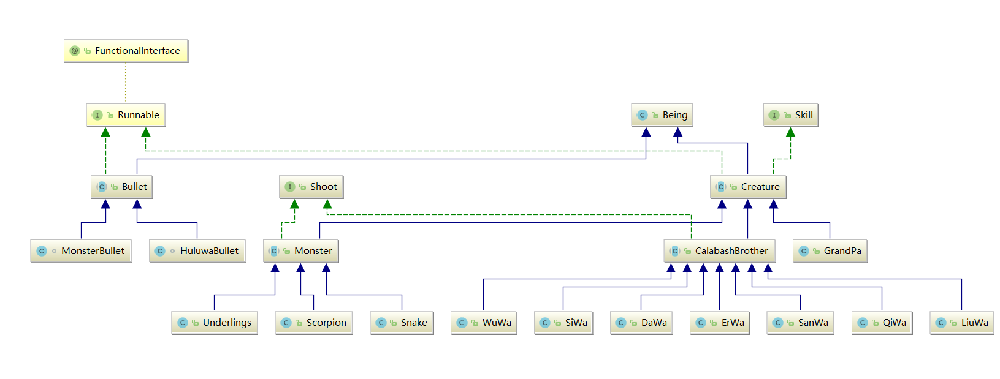
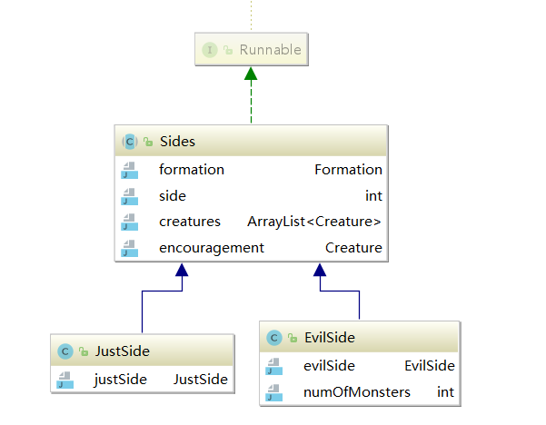

# 葫芦娃大战

## 一、游戏介绍

### 1.展示

- 葫芦娃失败


- 葫芦娃胜利


### 2.游戏机制

- 按空格键直接开始或者重开。

- 只给葫芦娃一方做了技能，为平衡游戏，妖怪一方的基础攻击力和血量都很高。

- 由于是随机移动，为了使游戏更快结束，每过五秒，生物的攻击力会增加5。

- 攻击效果

  > 实现了Shoot接口的生物可以发射炮弹，双方炮弹不一样。
  >
  > 炮弹打到生物身上会有“炸”的效果。
  >
  > 生物死亡了会在原地生成小坟墓，持续一段时间。

- 技能特效

  > ​	左下角有个技能栏，总共七个技能（对应七个葫芦娃），有冷却时间，生物死亡的话，上面会显示一个“死”字
  >
  > ​	大娃技能：增加自身攻击力10。
  >
  > ​	二娃技能：定位到蛇精，使其减少一定量生命值（蛇精死亡的话，技能无效）
  >
  > ​	三娃技能：增加自身防御力，并回复已损失生命的20%
  >
  > ​	四娃技能：群伤，对对所有人造成伤害，伤害量为自己攻击力的80%，由于是群伤，固有初始冷却值。
  >
  > ​	五娃技能：群伤，对面所有人造成固定的30点伤害
  >
  > ​	六娃技能：隐身伪装，会假死一段时间，这段时间他会变成小坟墓，无法移动攻击，但其他人也无法攻击到他。
  >
  > ​	七娃技能：瞬间将一个怪物吸到自己的葫芦里秒杀（除蛇精），初始冷却值30秒。
  >
  > ​	人工释放技能：按数字键1到7，释放时左边会有淡入淡出的特效。

- 游戏结束

  > 当葫芦娃一方全部死亡时，游戏失败，当妖怪一方全部死亡时，游戏胜利。此时会弹出失败或胜利的特效。

## 二、游戏实现

### 1.游戏元素的类图



- Being类是这个游戏元素的基类（空的）

- **子弹（Bullet）**和**生物（Creature）**继承Being，但他们都不够具体、丰富，所以他们的实现是抽象类，他们里面实现了各自派生类所共有的行为和属性。

- 更为详细的**怪物（Monster）**和**葫芦娃（CalabashBrother）**以及其具体的派生类，都赋予了各自生物不同的基础属性。

- **怪物**和**葫芦娃**都实现了**Shoot**这个接口，代表其可以发出子弹，目前**子弹**只派生出两个具体子弹类，区分了葫芦娃和怪物的子弹（方向不同，原画不同等），如果需要的话，可以派生出更多的子弹类，为每种生物都赋予不同的子弹，让游戏世界更丰富多彩。这种结构也极易扩展。符合**开闭原则**。

  ```java
  public Bullet shoot() {
          return new MonsterBullet(getPosition().getY(), getPosition().getX(), -1, this);
      }
  //通过派生子弹类，丰富子弹类型。
  
  ```

- **生物**类实现了**Skill**接口，分别都在之后的子类中具体实现，赋予不同生物不同的技能。

- **子弹**和**生物**都实现了**Runnable**接口，多线程编程使得游戏世界能动起来，用synchronized关键字锁定一定的资源，使得不会出现资源冲突等现象。

### 2.阵营

<<<<<<< HEAD

=======

>>>>>>> ea45bced498786d6483e1e0c6ad93971958c4d8d

- 游戏战斗分为两方，所以出现了**阵营（Sides）**这个实体，分别派生出**正义方（JustSide）**和**邪恶方（EvilSide）**两个阵营，阵营里面是鼓励师（爷爷和蛇精）和生物群（葫芦娃和蝎子精喽啰），用到了**组合（composition）**这种复用代码的方法。

- **阵营**也实现了**Runnable**接口，此线程主要是初始化里面的生物线程。

- 此外，阵营在一场游戏里，不同阵营**只有一个**，因此在这里运用了**单例模式**，这样访问里面的东西就更加方便了。

  ```java
  public class EvilSide extends Sides{
      private static EvilSide evilSide = new EvilSide();
      public static EvilSide getInstance(){
          return evilSide;
      }
      private EvilSide() {}
  }
  ```


### 3.游戏模型

- 因为前面那些都只是在数据上进行修改没有到UI界面上。因此这个游戏模型就是去联系UI和数据逻辑方面所做的工作
- 此游戏模型也是用的**单例模式**，方便获取它里面的一些元素。
- **游戏模型**主要是去做两件事情，更新UI和更新数据，并协调两者。所以主要去分俩线程分别去做这样的事情。

```java
public class GameModel implements Runnable{
    enum GameStatus{
        going, justWin, evilWin
    }

    private static GameModel gameModel;
    private GameStatus gameStatus;//游戏状态
    private Board board = Board.getInstance();
    private ExecutorService exec = Executors.newCachedThreadPool();
    private List<Bullet> bullets = new ArrayList<>();

    
    private Canvas canvas;
    public static GameModel getInstance() {
        if (gameModel != null)
            return gameModel;
        else {
            return null;
//            throw new Exception("GameModel还没有初始化好");
        }
    }

    GameModel(Canvas canvas) {
        Creature.setBoard(this.board);
        gameStatus = GameStatus.going;
        this.canvas = canvas;
        gameModel = this;
    }

    public void restart(){
        clearThreads();
        gameModel = new GameModel(canvas);
        JustSide.getInstance().restart();
        EvilSide.getInstance().restart();
    }

    @Description(todo = "得到战场")
    public Board getBoard() {
        return board;
    }


    @Description(todo = "线程分配")
    private void initThreads(){
        exec.execute(JustSide.getInstance());
        exec.execute(EvilSide.getInstance());
    }


    @Description(todo = "战场的的显示内容")
    private void displayBoard(){
        double width = this.canvas.getWidth();
        double height = this.canvas.getHeight();
        int n = this.board.getSIZE();

        double boardWidth = height * 6 / 7;
        double startLayoutX = (width - height) / 2 + 70;
        double startLayoutY = (height - boardWidth) / 2;
        double creatureSize = boardWidth / n;

        Image image = new Image("map.jpg");
        synchronized (board) {
            this.canvas.getGraphicsContext2D().drawImage(image, 0, 0, image.getWidth(), image.getHeight());
            for (int i = 0; i < n; i++) {
                for (int j = 0; j < n; j++) {
                    double x = startLayoutX + i * creatureSize;
                    double y = startLayoutY + j * creatureSize;
                    if (!(this.board.get(j, i).isEmpty())) {
                        this.board.get(j, i).getCreature().draw(this.canvas.getGraphicsContext2D(), x, y, creatureSize);
                    }
                }
            }
        }
        synchronized (bullets) {
            for (Bullet bullet : bullets) {
                bullet.draw(this.canvas.getGraphicsContext2D(), startLayoutX, startLayoutY, creatureSize);
            }
        }
    }

    @Override
    public void run() {
        initThreads();
        new Thread(() -> {
            int i = 0;
            Image image = new Image("win.png");
            while (true){
                if(JustSide.getInstance().isDeadAll()){
                    gameStatus = GameStatus.evilWin;
                    System.out.println("妖怪赢了");
                    image = new Image("fail.png");
                    break;
                }else if(EvilSide.getInstance().isDeadAll()){
                    gameStatus = GameStatus.justWin;
                    System.out.println("葫芦娃赢了");
                    break;
                }
                try {
                    i++;
                    System.out.println("第" + i + "次");
                    synchronized (GameModel.class){
                        GameModel.class.wait();
                    }
                } catch (InterruptedException e) {
                    e.printStackTrace();
                }
            }
            displayBoard();
            Image finalImage = image;
            Platform.runLater(()->{
                GameController.playBox(finalImage);
            });
            System.out.println("Game Over");
            clearThreads();
            try {
                TimeUnit.SECONDS.sleep(1);
            } catch (InterruptedException e) {
                e.printStackTrace();
            }
            ThreadInfo.threadPrint();
        }).start();
        new Thread(()->{
            while (gameStatus == GameStatus.going){
                Platform.runLater(this::displayBoard);
                try {
                    TimeUnit.MILLISECONDS.sleep(50);
                } catch (InterruptedException e) {
                    e.printStackTrace();
                }
            }
        }).start();
    }

    @Description(todo = "线程清理")
    private void clearThreads(){
        JustSide.getInstance().allToDie();
        EvilSide.getInstance().allToDie();
        for(Bullet bullet: bullets){
            bullet.fade();
        }
    }
```

### 4.UI界面

- UI界面使用javafx做的，主要就是去显示以及响应键盘鼠标事件等，并将其传给**游戏模型（GameModel）**响应信息。
- 这里我们主要做动画的是利用canvas去一帧一帧的播放我们数据层面的东西。以及利用了FadeTransition和ScaleTransition两种变换去做效果。

## 三、课程内容相关

### 1.面向对象思想

- 整个设计过程中都是从面向对象的角度去做的，像丰富的生物体，子弹体等。

### 2.注解

- 主要实现了两个注解

- 一个是对方法的注解，主要用于描述方法的作用。

  ```java
  @Target(ElementType.METHOD)
  @Retention(RetentionPolicy.CLASS)
  public @interface Description {
      String todo();
  }
  ```

- 一个是对类的注解，用于描述作者信息

  ```java
  @Target(ElementType.TYPE)
  @Retention(RetentionPolicy.CLASS)
  public @interface Author {
      String name() default "吴刚";
  }
  ```

### 3.Maven构建项目


- 整个项目用的是Maven的结构，并编写的Test用例去做测试。

### 4.整个项目最重要的一点就是：多线程编程

- 在我的世界里，**GameModel**是一个中间人的角色，他也是一个线程，从他出发，会生成两个主要功能的线程：一个是UI的更新线程，一个是数据的更新线程。
- 数据的更新线程会做一系列的初始化工作，生成生物的每个线程，并进行管理。
- 游戏结束后，会清理多余的数据线程。

- ### 
